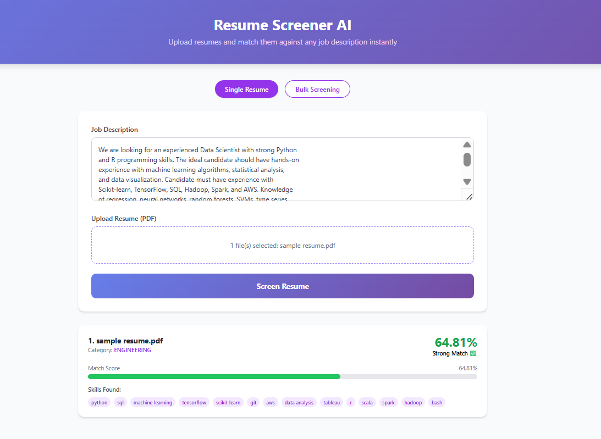

# 🤖 Resume Screener AI

An AI-powered resume screening web application that automatically analyzes resumes against job descriptions and ranks candidates by match score using Machine Learning and NLP.


---

## 🌐 Live Demo
👉 **[https://web-production-d332f.up.railway.app](https://web-production-d332f.up.railway.app/)**



---

## ✨ Features

- 📄 **PDF Resume Parsing** — Automatically extracts text from PDF resumes
- 🧠 **NLP Processing** — Text cleaning, lemmatization using spaCy and NLTK
- 📊 **Smart Match Scoring** — TF-IDF vectorization + keyword matching algorithm
- 🎯 **Job Category Prediction** — Predicts resume category with 75% accuracy
- 👥 **Bulk Screening** — Screen multiple resumes simultaneously
- 📈 **Visual Results** — Color coded match scores with progress bars
- 💾 **CSV Export** — Export all screening results to CSV
- 🚀 **REST API** — Full FastAPI backend with interactive docs

---

## 🛠️ Tech Stack

| Layer | Technology |
|---|---|
| Backend | FastAPI, Python 3.14.3 |
| Machine Learning | Scikit-learn, Random Forest |
| NLP | spaCy, NLTK, TF-IDF |
| PDF Parsing | pdfplumber |
| Frontend | HTML, Tailwind CSS |
| Deployment | Railway, GitHub |

---

## 📁 Project Structure
```
resume-screener/
├── app/
│   ├── main.py          # FastAPI app & endpoints
│   ├── model.py         # ML model & scoring logic
│   └── utils.py         # Text preprocessing & NLP
├── data/
│   └── cleaned_resumes.csv
├── models/
│   └── resume_model.pkl
├── templates/
│   └── index.html       # Frontend UI
├── requirements.txt
├── Procfile
└── README.md
```

---

## 🚀 API Endpoints

| Method | Endpoint | Description |
|---|---|---|
| GET | `/` | Web UI |
| GET | `/health` | API health check |
| POST | `/screen` | Screen single resume |
| POST | `/bulk-screen` | Screen multiple resumes |

---

## ⚙️ Local Setup

**1. Clone the repository:**
```bash
git clone https://github.com/HafizJee786/resume-screener.git
cd resume-screener
```

**2. Create virtual environment:**
```bash
python -m venv venv
venv\Scripts\activate
```

**3. Install dependencies:**
```bash
pip install -r requirements.txt
python -m spacy download en_core_web_sm
```

**4. Train the model:**
```bash
python -m app.model
```

**5. Run the app:**
```bash
uvicorn app.main:app --reload
```

**6. Open in browser:**
```
http://127.0.0.1:8000
```

---

## 📊 Model Performance

- **Algorithm:** Random Forest Classifier
- **Training Data:** 2484 resumes across 24 job categories
- **Accuracy:** 75.05%
- **Match Scoring:** Keyword matching + TF-IDF cosine similarity

---

## 💡 How It Works

1. User uploads PDF resume and pastes job description
2. System extracts text from PDF using pdfplumber
3. NLP pipeline cleans and lemmatizes the text
4. TF-IDF vectorizer converts text to numerical features
5. Cosine similarity calculates match percentage
6. Random Forest predicts job category
7. Results displayed with match score and skills found

---

## 👨‍💻 Author

**Hafiz Ali Hasnain** — CS Final Year Student  
🔗 [GitHub](https://github.com/HafizJee786)

---

## 📄 License
This project is open source and available under the [MIT License](LICENSE).
